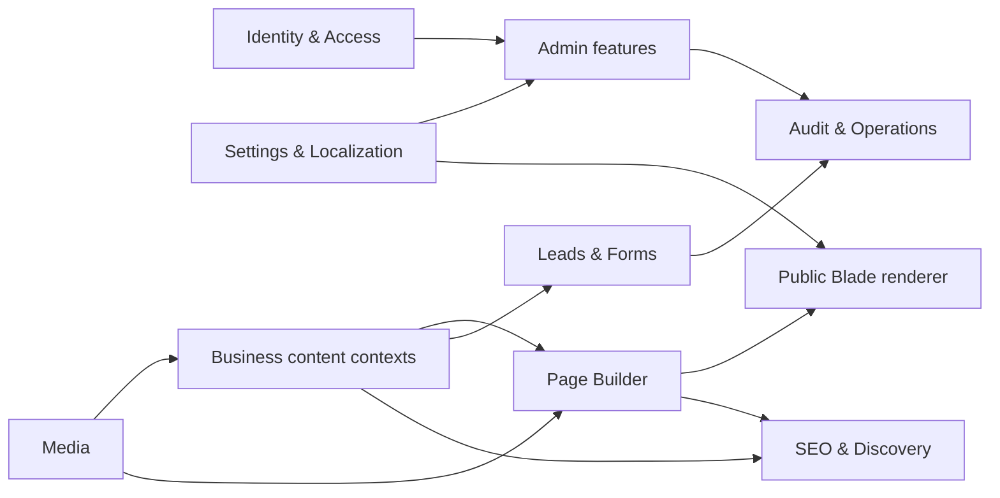

# MODULE MAP

## Status and interpretation

This is the planned bounded-context contract for delivery. At P02 the Laravel/Angular applications, routes, tables and permissions below are not yet implemented unless a later prompt marks them complete.

## Boundary rules

- Each context owns writes to its tables and exposes an Action/Service contract to other contexts.
- Cross-context reads may use explicit query/application services; cross-context controllers must not write another context's model directly.
- Shared contains technical primitives only, not mixed business logic or a generic `BaseRepository`.
- Laravel is the source of truth for validation, authorization, schema and public rendering.
- Angular route/menu visibility never replaces server Policy/Gate checks.
- Audit is append-only for ordinary admins; Analytics consumes events/aggregates and does not own transactional business data.

## Context catalog

Data names below are planned blueprint families; every physical table uses the explicit `hongvan_` prefix.

| Bounded context | Owned data from blueprint | Planned public route families | Planned Admin SPA route families | Permission namespace | Depends on |
|---|---|---|---|---|---|
| Identity & Access | users, sessions, roles, permissions, user preferences | None; Admin login is not a public content feature | `/admin/login`, `/admin/users`, `/admin/roles`, `/admin/permissions`, profile/security | `users.*`, `roles.*`, `permissions.*`, `profile.*` | Shared, Audit |
| Company Settings & Localization | settings/groups, languages/translations, branches, hours, social/contact channels | Company/contact data is rendered into relevant Blade pages | `/admin/settings`, `/admin/branches`, `/admin/localization` | `settings.*`, `branches.*`, `localization.*` | Identity, Audit |
| Media | folders, media, variants, tags, usage and operations | Media delivery URLs only; no public Media Manager | `/admin/media` | `media.view`, `media.upload`, `media.update`, `media.delete`, `media.manage` | Identity, Settings, Audit, Queue/Storage |
| Page Builder, Theme & Navigation | themes/versions, pages/translations/versions, schedules, locks, templates, preview sessions, menus and global regions | CMS-managed slugs, signed `/preview/page-builder/*`, header/footer/menu output | `/admin/pages`, `/admin/page-builder`, `/admin/themes`, `/admin/menus`, `/admin/global-regions` | `pages.*`, `pages.publish`, `themes.*`, `menus.*` | Identity, Media, Settings, Content query contracts, Audit, Queue/Cache |
| Product Catalog | categories, brands, products, translations, media, tags, attributes/specifications and related links | `/san-pham`, category/product detail slugs, quote CTA | `/admin/products`, `/admin/product-categories`, `/admin/brands` | `products.*`, `product_categories.*`, `brands.*` | Media, Settings, SEO, Audit |
| Crop Solutions | crop categories, crops/stages, solutions/translations and solution-product links | `/giai-phap-cay-trong` and detail slugs | `/admin/crops`, `/admin/crop-solutions` | `crops.*`, `crop_solutions.*` | Products, Media, SEO, Audit |
| Services | service categories, services/translations and media | `/dich-vu` and detail slugs | `/admin/services` | `services.*` | Media, Settings, SEO, Audit |
| Transportation | vehicle types/vehicles/media, routes, service areas and transport requests/history | Transportation introduction/routes and request form | `/admin/transportation`, `/admin/transport-requests` | `transportation.*`, `transport_requests.*` | Media, Leads, Settings, Audit |
| Warehouses | warehouses/translations/media/facilities/services and requests/history | `/kho-bai`, warehouse detail and request form | `/admin/warehouses`, `/admin/warehouse-requests` | `warehouses.*`, `warehouse_requests.*` | Media, Leads, Settings, Audit |
| Leads & Forms | leads, assignments, status history, notes, contact/quote requests, versioned forms/submissions | `/lien-he`, `/yeu-cau-bao-gia`, transportation/warehouse request forms | `/admin/leads`, `/admin/contact-requests`, `/admin/quote-requests`, service-request queues | `leads.*`, `contact_requests.*`, `quote_requests.*`, `form_submissions.*` | Identity, Products/Services/Transportation/Warehouses references, Audit, Notifications |
| Content | post categories/posts/translations/tags | `/tin-tuc` and article/category slugs | `/admin/posts`, `/admin/post-categories` | `posts.*`, `post_categories.*` | Media, SEO, Audit |
| Showcase | galleries/items, partners, certifications, projects/translations/media | Company profile, gallery, partners, certifications and project/case-study pages | `/admin/showcase` | `showcase.view|create|update|delete|restore|publish` | Media, SEO, Audit |
| SEO, Discovery & Analytics | SEO metadata, redirects, sitemap exclusions, search logs, daily page views and consent | search, sitemap, robots, redirect and consent behavior | `/admin/seo`, `/admin/redirects`, `/admin/analytics` | `seo.*`, `redirects.*`, `analytics.view` | All publishable contexts, Settings, Queue/Cache |
| Audit & Operations | audit logs, notifications, jobs/batches/failures, cache/locks | Health endpoints only when deployment policy allows | `/admin/audit-logs`, notification/operation views | `audit.view`, `notifications.*`, `operations.view` | Identity; consumes events from every Admin mutation |

Public and Admin route names above are route families for planning. Exact route names, slugs and API resources are finalized in their owning prompts and must preserve the `/api/admin/v1` convention for Admin APIs.

## Dependency view

## Integration rules

- Page Builder dynamic blocks read through allowlisted data-source contracts; they do not query arbitrary tables or execute stored code.
- Leads may reference a product/service/transport/warehouse source, but lead status/history remains owned by Leads.
- Media deletion must check `media_usages` across contexts and follow authorization/retention rules.
- SEO listens to publish/update events; it does not mutate domain content.
- Notifications and exports use queues where work is slow or retryable.

## Explicitly out of scope

- No cart, checkout, payment, order or marketplace.
- No accounting, invoicing, payroll or HRM.
- No warehouse stock-by-lot, picking, receiving or WMS workflow.
- No real-time fleet dispatch, GPS tracking or TMS workflow.
- No ERP-style master-data expansion without an approved change request and ADR.
